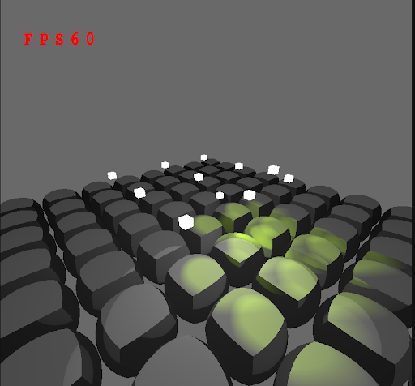
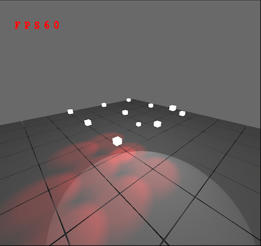
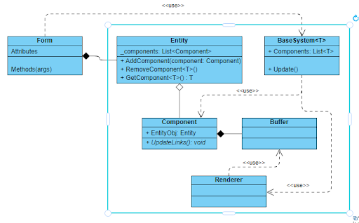

## Internature.

Application for interaction with 3D-objects.
Used on Windows.

 
 

Consist of 3 parts:
1) OpenGL implementation (Imgui as GUI, OpenTK as c# wrapper).
2) Direct-X 3D engine (restricted possibilities, intended only for certain purposes, but have all main systems.)
3) Application on 3D engine for work with 3D objects (intended only for certain purposes). Window Forms as GUI.

OpenGL implementation does not have clear architecture, developed only for investigation of OpenGL

Direct-X implementation is a full engine with most major systems: simple to wide and readjust. Simplified implementation is:

 

Go into **develop branch** to get actual version.

